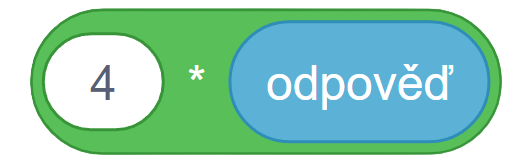

# Řešení

### Počet kol vypočítáme $4*počet$ $kol$ (počet kol == odpověď)

### Náš kompletní program vypadá následovně.

1. Zeptáme se na počet aut.
2. Odpověď se uloží do proměnné *odpověď*
3. Vypyšeme odpověď spojení řetězce "Počet kol: " a výsledku.