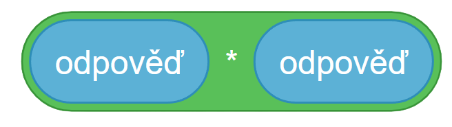
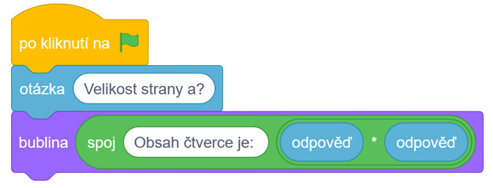

# Řešení

- Obsah čtverce vypočítáme pomocí operátoru '\*' a to tak, že vynásobíme odpověď s odpovědí ( $a*a$ )

### Naše kompletní řešení vypadá následovně:

- Zahájení programu pomocí vlajky
- Zeptáme se na počet aut (odpověď se následně uloží do proměnné odpověď)
- Poté vypíšeme spojení řetězce "Obsah čtverce je: " a obsah čtverce
