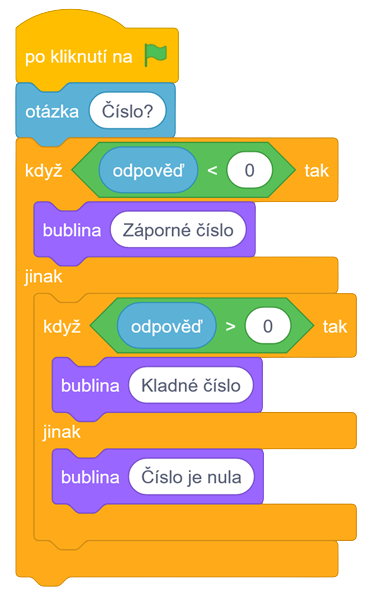

# Řešení

1. Zeptáme se na číslo
2. Pokud je číslo menší než 0, tak vypíšeme, že se jedná o záporné číslo
3. Pokud není, tak program pokračuje
4. Když je číslo větší než 0, tak vypíšeme, že se jedná o kladné číslo
5. Pokud není, tak program pokračuje
6. Číslo musí být nula