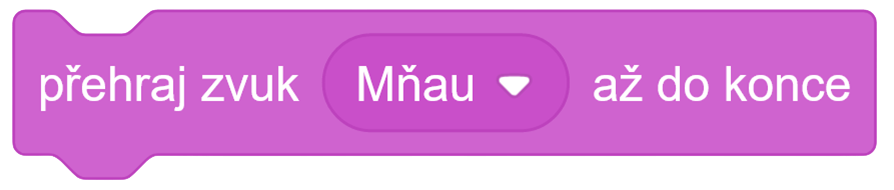
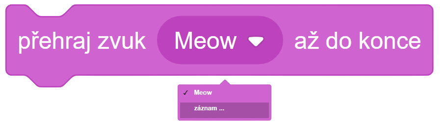
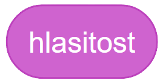
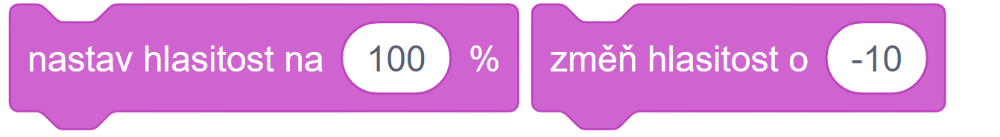

# Teorie

## Zvuk I.

Scratch nám umožňuje přehrávat různé zvuky.

Jako například zvuk 'Mňau'

Scratch vám taky umožňuje zaznamenat libovolný zvuk a poté ho využívat ve svém programu. Stačí rozkliknout nabídku zvuků a kliknout na **záznam**.

Zvuk obsahuje jednu proměnnou jménem **hlasitost**.

Kterou můžeme upravovat s následujícími bloky.

