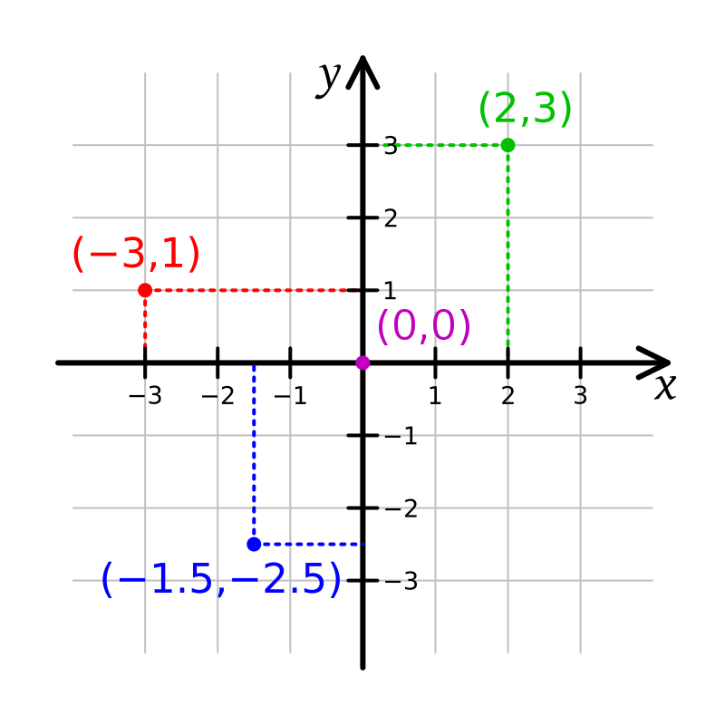

# Teorie

## Souřadnicový systém

Souřadnicový systém ve Scratchi je jednoduchý.
- Máme **horizontální** osu **x**
- Máme **vertikální** osu **y**

> Pokud chceme posunout Scratche doprava, tak přidáme na **x ose** 1.

> Pokud chceme posunout Scratche dolů, tak odečteme na **y ose** 1. 

## Pohyb I.

V tomhle cvičení budeme potřebovat hlavně 2 bloky.

- Blok nalevo posune Scratche po **ose x** (doleva nebo doprava)
- Blok napravo posune Scratche po **ose y** (nahoru nebo dolů)