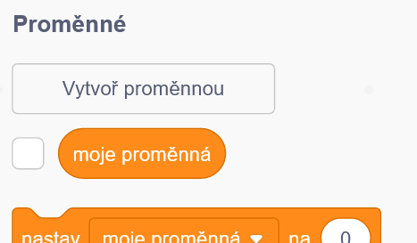
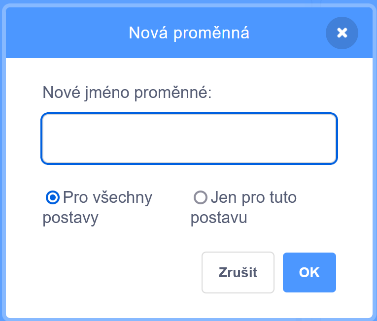
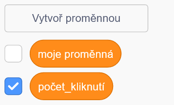
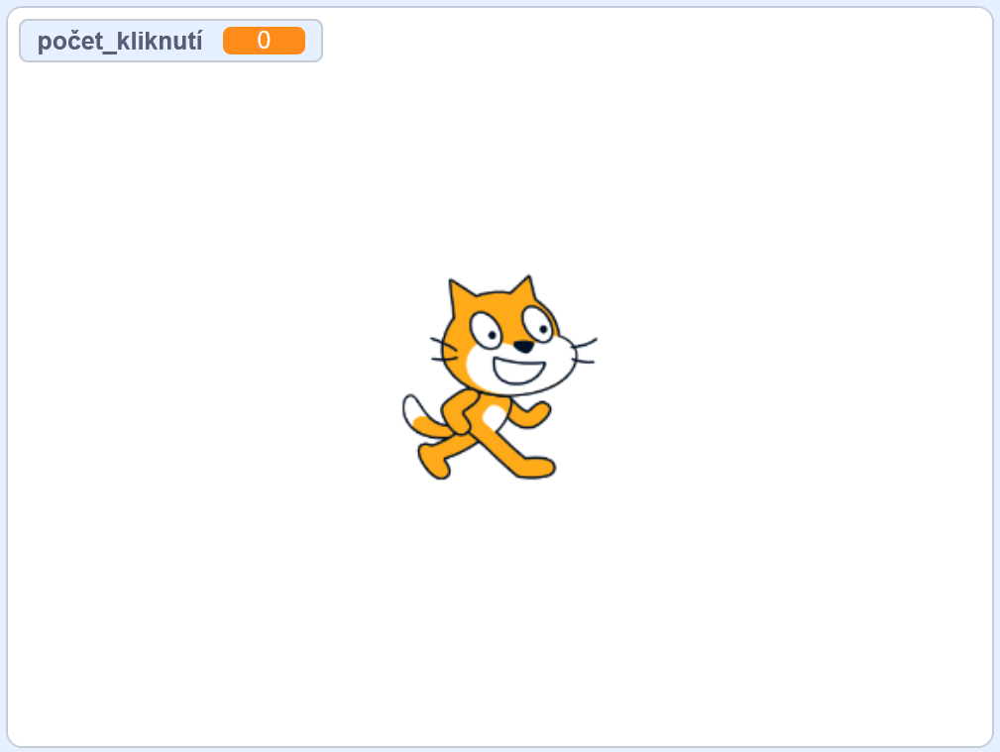
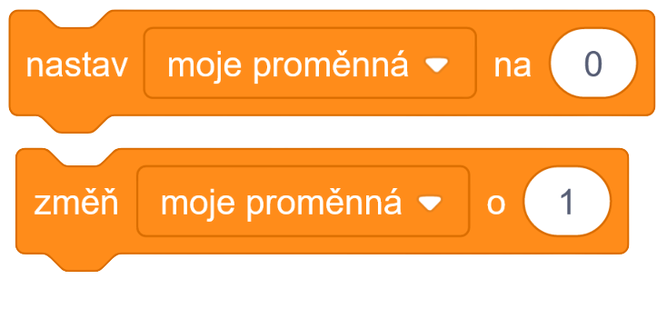

# Teorie

## Proměnné I.

Proměnná je nějaký symbol, který představuje nějakou hodnotu.

> Například počet kliknutí ze začátku má hodnotu 0, ale po 5 kliknutí bude mít hodnotu 5.

Už jsme se s proměnnými v předešlých cvičení setkali, jedná se např. o *odpověď* po otázce nebo *hlasitost* u zvuku.

### Vytvoření proměnné

Proměnnou vytvoříme tak, že si rozklikneme oranžovou nabídku proměnné a hned pod nadpisem Proměnné klikneme na tlačítko **Vytvoř proměnnou**.

Tam poté zadáme jméno proměnné a klikneme OK.

Naše proměnná se zobrazí hned po výchozí proměnné *moje proměnná*

Pokud necháme záškrtnutý box vedle proměnné, tak se nám zobrazí ve výstupovém okně.

### Měnění proměnné

Proměnnou můžeme změnit následujícími bloky.

- Blok nahoře nastaví proměnnou na určité číslo
- Blok dole změní proměnou o určité číslo