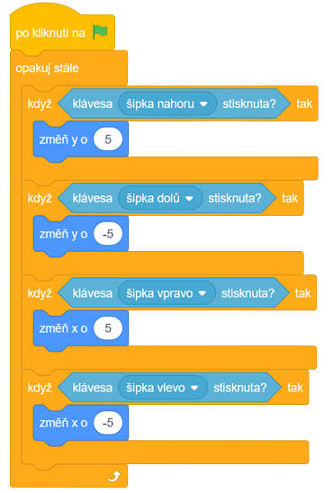

# Teorie

## Funkce I.

Funkce nám umožňují nějakou složitou sekvenci bloků nahradit jedním blokem.

Převážně se používají pro přehlednější kód.

### Příklad

Když si vezmeme kód pro pohyb Scratche:

Můžeme ho zjednodušit do funkce následovně.

Poté náš kód vypadá přehledněji.

