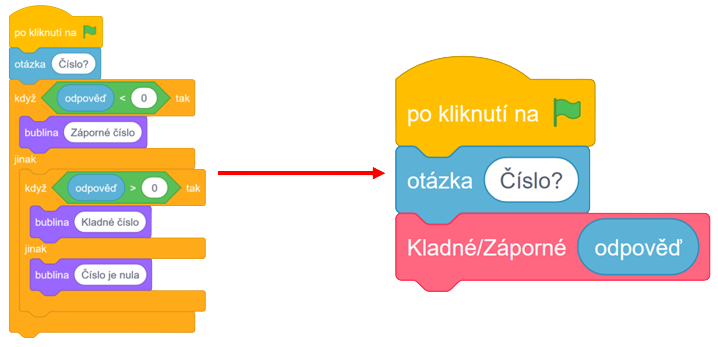

# Zadání

### Zjednodušte následující program do funkce s parametrem **rychlost**, který bude rozhodovat o tom, jak rychle se bude Scratch pohybovat.

[Link na teorii](teorie.md)

[Link na řešení](%C5%99e%C5%A1en%C3%AD.md)