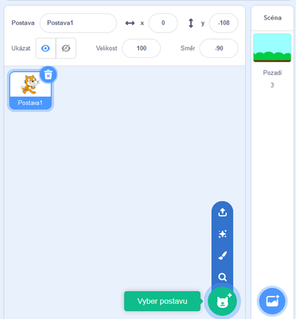
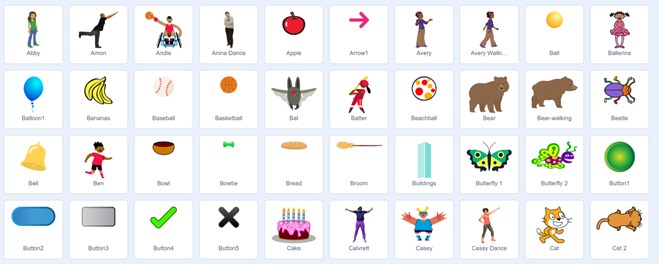
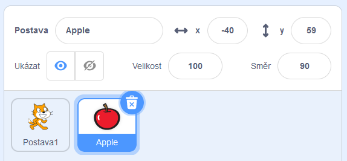
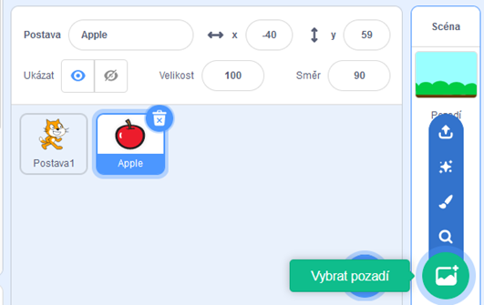
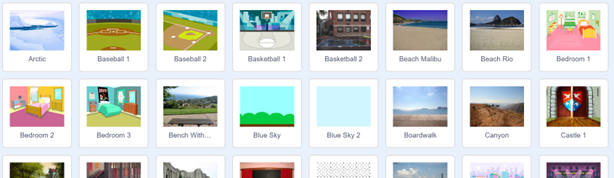
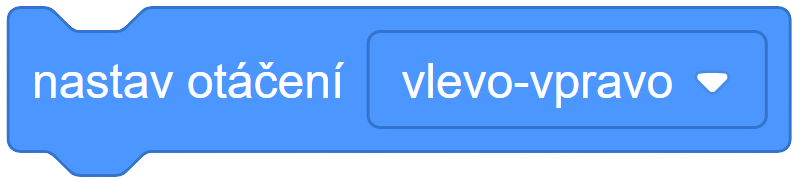
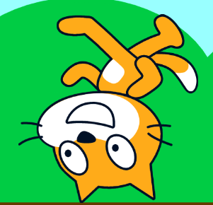
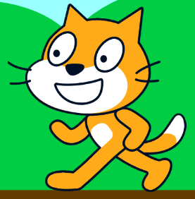
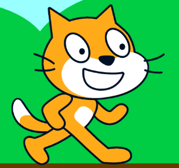
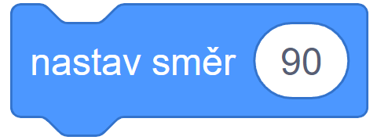

# Teorie

## Postavy I.

Přidáme postavu, kliknutím na tlačítko **"Vyber postavu"** (viz. obrázek)

Poté se nám otevře nabídka, kde si můžeme vybrat libovolnou postavu (Sprite).

Poté, co přidáme naši postavu, tak se nám automaticky modře zvýrazní. To znamená, že daná postave je vybraná a díváme se tedy na bloky této postavy.

### Každá postava má své vlastní bloky!

## Pozadí I.

Přidáme pozadí, kliknutím na tlačítko **"Vyber pozadí"**, které je vedle tlačítka "Vyber postavu". (viz. obrázek)

Poté se nám otevře nabídka, podobné té u postav. Můžeme si vybrat pozadí jednoduchým kliknutím na ikonu pozadí.

## Události II.

Aby mohli mezi sebou postavy komunikovat, tak používají tzv. **zprávy**.

- Po obdržení zprávy "výhra", proveď nějaké bloky
- Vyšli zprávu "výhra"
- Vyšli zprávu "výhra" a **počkej než se všechny bloky pod zprávou "výhra" provedou**.

## Pohyb II.

V této části teorie o pohybu se budeme věnovat otáčení.

### Otáčení má 3 stavy

- Otáčení dokola

- Otáčení vlevo-vpravo

 

- Otáčení neotáčet

### Otáčení

Poté jak nastavíme stav otáčení tak otáčíme postavu následujícím blokem.

