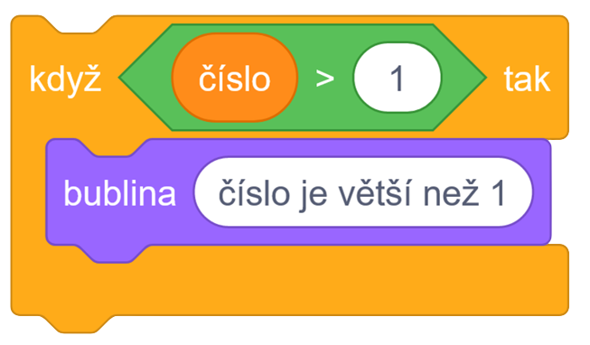
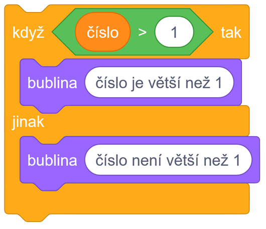

# Teorie

## Ovládání I.

Bloky ovládání se zaměřují převážně na ovládání chodu programu.
    
### If statements

- Když je **číslo větší než 1** tak vypiš "číslo je větší než 1".

### If/else statements

- Když je **číslo větší než 1** tak vypiš "číslo je větší než 1".
- Když není **číslo větší než 1** tak vypiš "číslo není větší než 1".