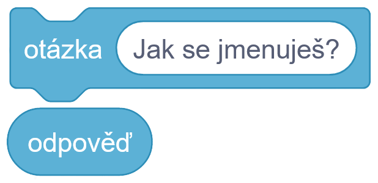
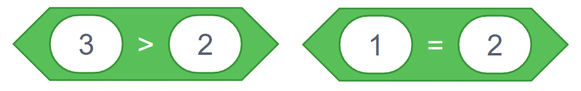

# Teorie

## Vnímání I.

Bloky vnímání se zaměřují na detekování nějakých událostí v projektu.

Následné příklady:

- Je mezerník stisknut?
- Scratch se zeptá: "Jak se jmenuješ?" a odpověď se uloží do proměnné 'odpověď'

## Operátory I.

Operátory se zabývají různými operacemi s proměnnými.

### Jako například jednoduchými operaci s čísly

- Výsledek 2+2 --> 4
- Výsledek 3*23 --> 69

### Nebo porovnáním čísel

- Je 3 větší než 2?
- Je 1 rovná 2?

### Nebo práci s řetězci

- spojení dvou řetězců "jablko" a "banán" do jednoho řetězce "jablkobanán"
- Obsahuje "jablko" písmeno 'a'?
